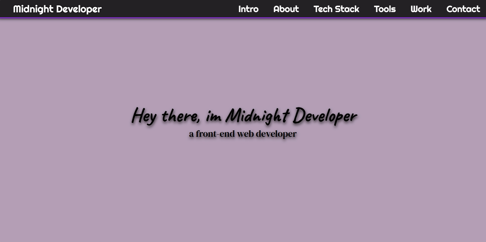

# 💼 Personal Portfolio Webpage

## 📖 Overview
This project is part of my FreeCodeCamp Responsive Web Design Certification.

The objective was to build a Personal Portfolio Webpage using only HTML and CSS. A fully responsive site that showcases my projects, skills, and contact information while fulfilling all FreeCodeCamp’s user stories.

I designed this portfolio for my developer alias, “Midnight Developer”, to reflect both my professional work and creative flair. The project demonstrates navigation structure, responsive layout, section organization, and interactive styling.

The page serves as my developer portfolio, featuring a welcome section, about section, tech stack overview, tools I use, project previews, and contact links all in a clean, accessible design.

## ✨ Features
- Fixed top navigation bar that remains visible while scrolling.
- Welcome section with full viewport height and intro text.
- About section introducing myself and my work.
- Tech stack and tools sections with categorized layouts.
- Projects section displaying previous FreeCodeCamp builds with preview images.
- External links to GitHub, LinkedIn, Facebook, Threads, and more.
- Responsive design with media queries for mobile, tablet, and desktop.
- Smooth scrolling navigation and hover effects throughout.

## 🛠️ Built With
HTML – semantic structure, layout, and accessible markup.
CSS – styling, flexbox layout, media queries, and hover effects.

## 🧰 Skills Demonstrated
- Semantic HTML structuring.
- Responsive web design using Flexbox and media queries.
- Fixed navigation bar implementation.
- Smooth scroll and anchor link navigation.
- Section-based design and content organization.
- Font Awesome icon usage and Google Fonts integration.
- Project gallery with linked previews.
- Gothic-inspired yet professional visual theme.

## 🚀 How to Use
<a href="https://midnight-developer-ts.github.io/personal-portfolio-project/">Click here to view the project</a>

Or clone/download this repository and open **index.html** in your browser.

1. Use the navbar to explore each section of the page.
2. Scroll through to view About, Skills, Tools, and Projects.
3. Click on a project tile to visit live project demos.
4. Use the contact links at the bottom to connect with me or view my GitHub and social profiles.
5. Resize the browser window to see responsive adjustments.

## 📂 Project Structure
portfolio-project/ | **project main folder**

│── index.html | **main webpage**

│── css/ | **styling folder**

│   └── styles.css | **styling**

│── images/ | **images folder**

│   └── website-favicon.png | **favicon**

│   └── website-preview.png | **preview image**

│   └── product-landing-page.png | **project preview**

│   └── technical-documentation-page.jpeg | **project preview**

│   └── survey-form-page.jpeg | **project preview**

│── README.md | **project details**

## 📌 Learning Goals
- Build a professional developer portfolio using HTML and CSS.
- Create a full-page layout with sections for About, Projects, and Contact.
- Design a fixed navigation bar with smooth anchor navigation.
- Showcase previous FreeCodeCamp projects within a gallery.
- Apply media queries for responsiveness across all devices.

## 🎯 Certification Project Requirement Checklist
This project was built to meet all the user stories for the FreeCodeCamp Personal Portfolio Webpage project.

1. ✅ A welcome section with id="welcome-section".
2. ✅ The welcome section includes an &lt;h1&gt; element with text.
3. ✅ The &lt;h1&gt; is not empty.
4. ✅ A projects section with id="projects".
5. ✅ At least one element with a class of project-tile.
6. ✅ Each project tile includes at least one &lt;a&gt; element linking to a project.
7. ✅ A navbar with id="navbar".
8. ✅ The navbar contains anchor links to page sections.
9. ✅ A link with id="profile-link" that opens in a new tab.
10. ✅ The profile link has a target="_blank" attribute.
11. ✅ At least one media query is used for responsiveness.
12. ✅ The navbar is fixed at the top of the viewport.

✅ All FreeCodeCamp requirements are complete, and the project works as expected.

## 📸 Preview

## 🗒️ Notes
- Some social or contact links lead to external professional profiles.
- Project links direct to completed FreeCodeCamp project pages.
- The site layout and design are optimized for accessibility and readability.
- This project demonstrates the developer portfolio requirement for the Responsive Web Design Certification.